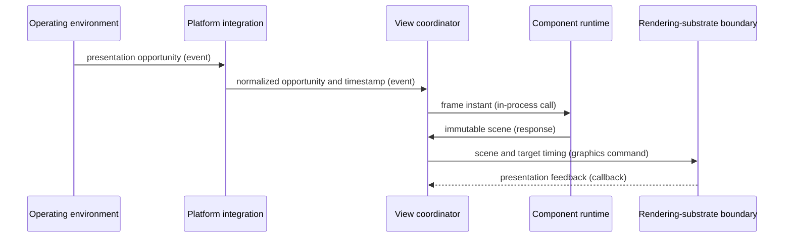

# Display-synchronized frame flow

## Mapping

`CAP-VIEW-002`: The system must schedule frames from display-synchronized presentation opportunities and expose the corresponding frame timestamps.

## Behavior

## Failure path

If timing identity, monotonic order, scene ownership, or feedback validation fails, View coordinator records a missed or failed frame for the affected view.
