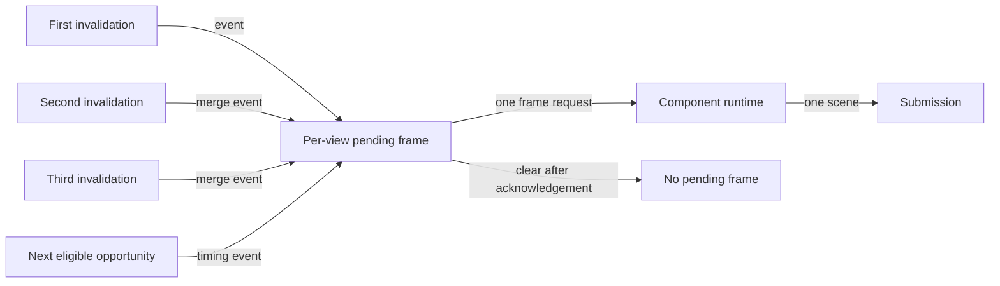

# Invalidation coalescing flow

## Mapping

`CAP-VIEW-003`: When a view receives several invalidations before its next eligible frame, the system must coalesce them into one scheduled update.

## Behavior

## Failure path

If invalidations cross view identities or arrive during teardown, View coordinator rejects them. A failed submission retains one bounded retry state rather than duplicating requests.
