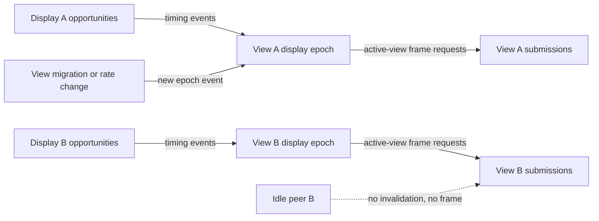

# Independent display pacing flow

## Mapping

`CAP-VIEW-004`: When views occupy displays with different timing, the system must pace each active view from its associated display without rendering an idle peer.

## Behavior

## Failure path

If a view uses another display's clock, misses the adoption bound, renders an idle peer, or lacks independent evidence, qualification fails the capability.
