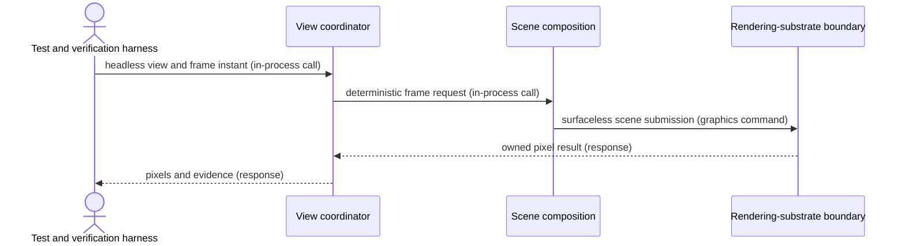

# Surfaceless rendering flow

## Mapping

`CAP-VIEW-005`: The system must render and return pixels without creating a visible or hidden top-level window or connecting to an interactive display service.

## Behavior

## Failure path

If the candidate creates or contacts a window, compositor, interactive display service, drawable, swapchain, or presentation call, the harness fails the capability and releases the headless view.
