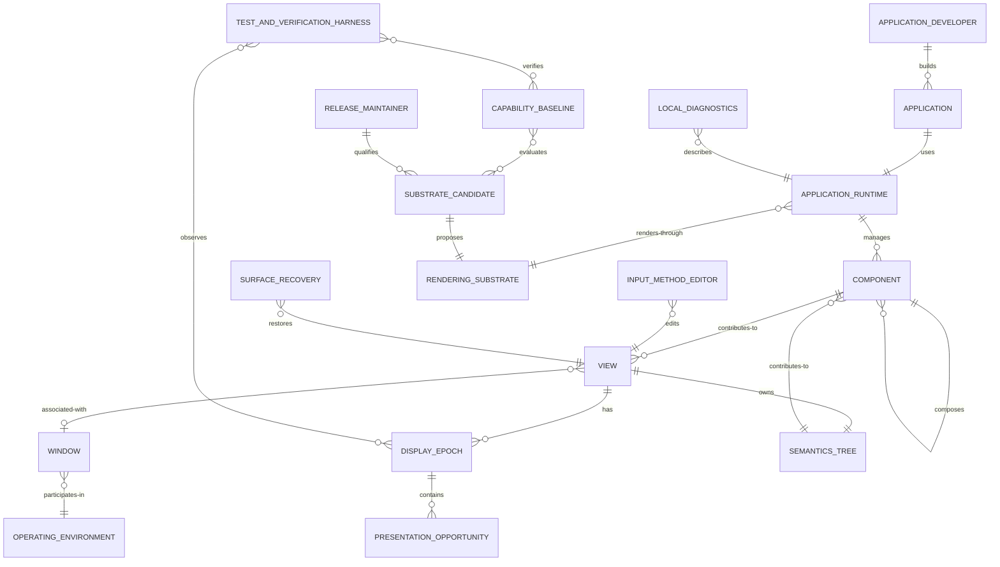

# Domain model

The model describes product concepts and their relationships. It doesn't define implementation modules or processes.

## Relationship rules

- A view owns independent focus, metrics, semantics identity, lifecycle, and presentation state.
- A component can contribute visual and semantic content to a view without owning the operating environment.
- A capability baseline evaluates complete substrate candidates. It doesn't waive product capabilities for one candidate.
- A display epoch ends when display association or timing mode changes.
- Surface recovery preserves application-runtime state unless the operating environment explicitly invalidates that state.
- Local diagnostics remain inside the declared machine-local trust boundary.
- Exported telemetry crosses that boundary and remains outside P0.
