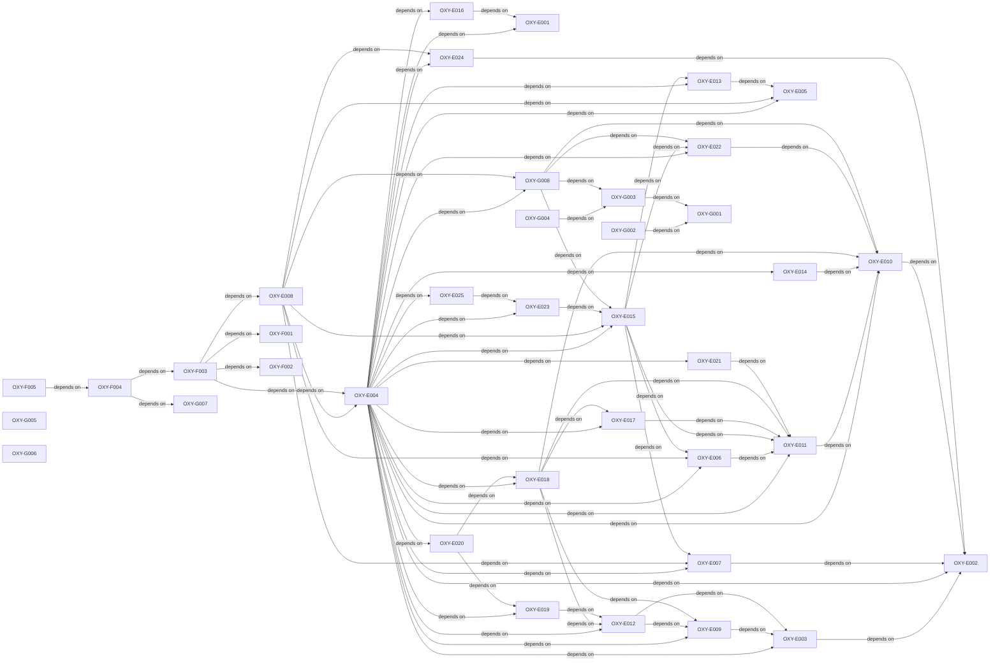

# Qualification planning critical path

- **Version:** v0.5.0
- **Active story points:** 130
- **Active phase:** Linux candidate-adapter readiness in Wayland-then-X11 order, integrated-candidate qualification preparation, and shared application-runtime work.

## Active backlog summary

| Epic   | Points | Scope                                       |
| :----- | -----: | :------------------------------------------ |
| Epic E |     79 | Specification landings and Linux readiness. |
| Epic F |     19 | Integrated substrate candidate on Linux.    |
| Epic G |     32 | Shared application runtime.                 |
| Total  |    130 | Active work only.                           |

## Critical path

The 45-point critical path is:

1. `OXY-E002`
2. `OXY-E010`
3. `OXY-E011`
4. `OXY-E006`
5. `OXY-E015`
6. `OXY-E023`
7. `OXY-E025`
8. `OXY-E004`
9. `OXY-E008`
10. `OXY-F003`
11. `OXY-F004`
12. `OXY-F005`

`OXY-G008` reaches 24 points before `OXY-E004`; `OXY-E023` and `OXY-E025` reach 26 points and determine the freeze date.

## Build order

Each arrow means "depends on."

## Phasing strategy

This phase lands the qualification contracts and lock inputs, enables candidate-adapter readiness for Wayland and then X11, and prepares the integrated candidate under the frozen suite. Shared crates start against a null or test substrate without a readiness flag.

macOS and Windows remain deferred because their reference hardware is blocked. The focused substrate candidate remains deferred unless the integrated candidate fails hard-gate eligibility in Wayland. Comparable measurement, provisional and final selection evidence, Phase 3B promotion, and production delivery remain deferred.
