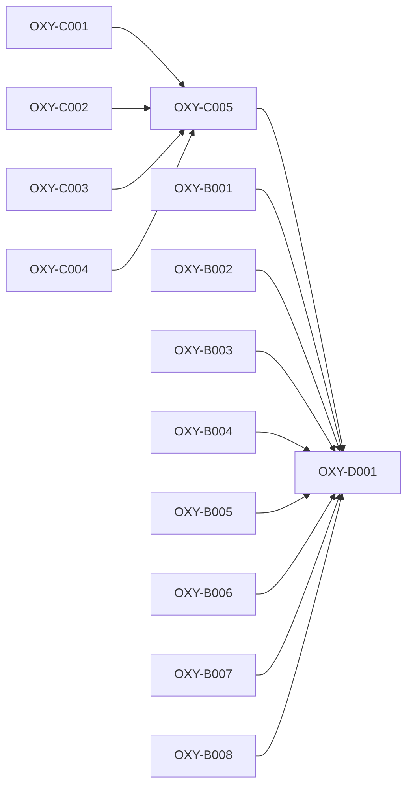

# Qualification planning critical path

- **Version:** v0.2.13
- **Active story points:** 43
- **Active phase:** Pre-implementation qualification research, lock-input tooling, and readiness reconciliation

## Critical path

The three co-critical paths are 10 story points each:

1. `OXY-C001` → `OXY-C005` → `OXY-D001`
2. `OXY-C002` → `OXY-C005` → `OXY-D001`
3. `OXY-C004` → `OXY-C005` → `OXY-D001`

`OXY-C003` and every Epic B input run in parallel. They must complete before `OXY-D001`, but they don't lengthen the active critical paths.

The next critical epic is Epic C, Qualification-lock input tooling. Its three co-critical branches gate the readiness report and the Stage 3 reconciliation.

## Build order

An arrow points from a prerequisite to a ticket that depends on it. Dependencies on completed tickets are satisfied and don't appear in the active graph.

## Phasing strategy

This active plan completes the remaining work permitted while `contracts/qualification-lock.json` has `candidateImplementationReady: false`: external-contract snapshots, capability-baseline authoring, raw-measurement templates, reference-environment inspection, readiness reporting, and the research and coordination inputs that reconcile them.

`OXY-D001` consolidates the evidence, names every missing approved or captured lock input, and routes required Stage 3 revisions without claiming readiness. The work runs inside the reproducible devenv shell.

Candidate adapters, the integrated engine fork, shared product capabilities, scored probes, and measurements remain deferred. After Stage 3 reconciles the research results and approved pre-implementation inputs into a lock with `candidateImplementationReady: true`, Stage 4 can release another minor version to plan both candidates symmetrically. Measurement and scoring remain deferred until the later `measurementReady: true` gate. Production planning remains prohibited until mandatory Phase 3B.
