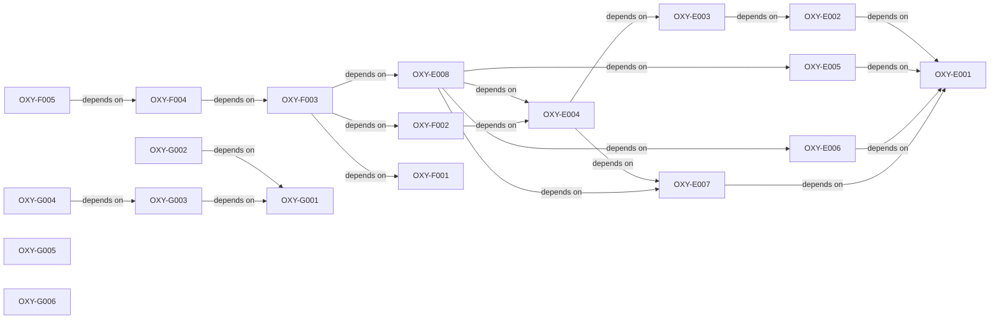

# Qualification planning critical path

- **Version:** v0.5.0
- **Active story points:** 94
- **Active phase:** Linux provisional qualification of the integrated substrate candidate and the shared application runtime.

## Active backlog summary

| Epic   | Points | Scope                                       |
| :----- | -----: | :------------------------------------------ |
| Epic E |     49 | Specification landings and Linux readiness. |
| Epic F |     19 | Integrated substrate candidate on Linux.    |
| Epic G |     26 | Shared application runtime.                 |
| Total  |     94 | Active work only.                           |

## Critical path

The 47-point critical path is:

1. `OXY-E001`
2. `OXY-E002`
3. `OXY-E003`
4. `OXY-E004`
5. `OXY-E008`
6. `OXY-F003`
7. `OXY-F004`
8. `OXY-F005`

## Build order

Each arrow means "depends on."

## Phasing strategy

This phase covers Linux provisional qualification work for the integrated substrate candidate and the shared application runtime. It sets per-environment candidate-adapter readiness for Wayland and X11, then builds the integrated bridge and adapter path under the frozen suite. The shared crates start against a null or test substrate without a readiness flag.

macOS and Windows remain deferred because their reference hardware is blocked. The focused substrate candidate remains deferred unless the integrated candidate fails hard-gate eligibility on Wayland. Comparable measurement, scoring, final selection, Phase 3B promotion, and production delivery remain deferred.
