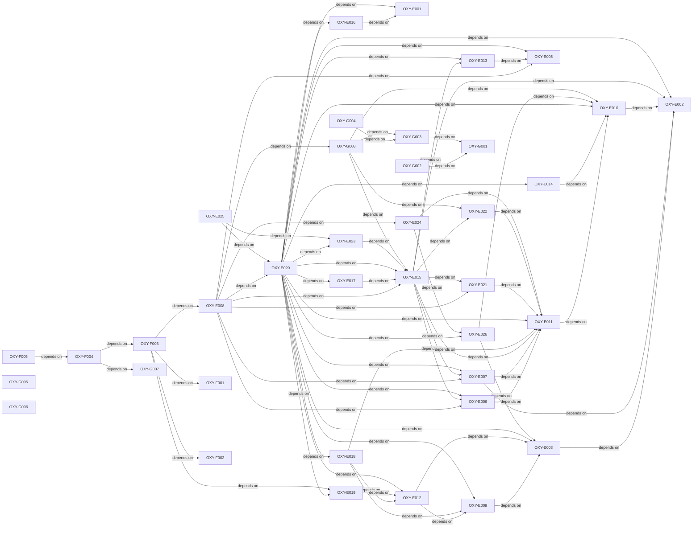

# Qualification planning critical path

- **Version:** v0.5.0
- **Active story points:** 131
- **Active phase:** Linux candidate-adapter readiness in Wayland-then-X11 order, integrated-candidate qualification preparation, and shared application-runtime work.

## Active backlog summary

| Epic   | Points | Scope                                       |
| :----- | -----: | :------------------------------------------ |
| Epic E |     80 | Specification landings and Linux readiness. |
| Epic F |     19 | Integrated substrate candidate on Linux.    |
| Epic G |     32 | Shared application runtime.                 |
| Total  |    131 | Active work only.                           |

## Critical path

The 43-point critical path has four equal sequences:

1. `OXY-E002` -> `OXY-E010` -> `OXY-E011` -> `OXY-E006` -> `OXY-E015` -> `OXY-E017` -> `OXY-E020` -> `OXY-E008` -> `OXY-F003` -> `OXY-F004` -> `OXY-F005`
2. `OXY-E002` -> `OXY-E010` -> `OXY-E011` -> `OXY-E007` -> `OXY-E015` -> `OXY-E017` -> `OXY-E020` -> `OXY-E008` -> `OXY-F003` -> `OXY-F004` -> `OXY-F005`
3. `OXY-E002` -> `OXY-E010` -> `OXY-E011` -> `OXY-E006` -> `OXY-E015` -> `OXY-E023` -> `OXY-E020` -> `OXY-E008` -> `OXY-F003` -> `OXY-F004` -> `OXY-F005`
4. `OXY-E002` -> `OXY-E010` -> `OXY-E011` -> `OXY-E007` -> `OXY-E015` -> `OXY-E023` -> `OXY-E020` -> `OXY-E008` -> `OXY-F003` -> `OXY-F004` -> `OXY-F005`

`OXY-E015` waits for both equal-cost Linux input branches, and `OXY-E020` waits for both equal-cost reconciliation branches. `OXY-E025` also reaches 30 points; `OXY-G008` reaches 24 points. Neither extends `OXY-F005`.

## Build order

Each arrow means "depends on."

## Phasing strategy

This phase lands the qualification contracts and lock inputs, enables candidate-adapter readiness for Wayland and then X11, and prepares the integrated candidate under the frozen suite. Shared crates start against a null or test substrate without a readiness flag.

macOS and Windows remain deferred because their reference hardware is blocked. The focused substrate candidate remains deferred unless the integrated candidate fails hard-gate eligibility in Wayland. Comparable measurement, provisional and final selection evidence, Phase 3B promotion, and production delivery remain deferred.
