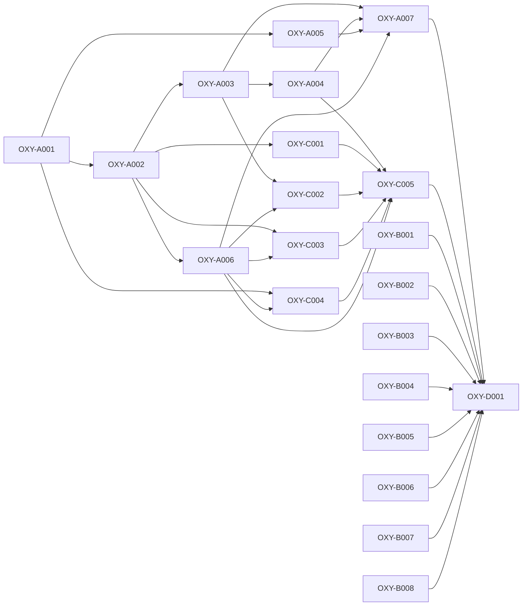

# Qualification planning critical path

- **Version:** v0.1.0
- **Active story points:** 74
- **Active phase:** Pre-implementation qualification foundation and decision research

## Critical path

The primary critical path is 23 story points:

1. `OXY-A001`
2. `OXY-A002`
3. `OXY-A003`
4. `OXY-A004`
5. `OXY-A007`
6. `OXY-D001`

The co-critical baseline branch is `OXY-A001` → `OXY-A002` → `OXY-A003` → `OXY-C002` → `OXY-C005` → `OXY-D001`, also 23 story points. Parallel platform, layout, security, hardware-access, and assessor work must finish before `OXY-D001` even when it isn't on either longest dependency chain.

## Build order

An arrow points from a prerequisite to a ticket that depends on it.

## Phasing strategy

This active plan implements only work permitted while `contracts/qualification-lock.json` has `candidateImplementationReady: false`: repository scaffolding, offline contract validators, evidence writers, external-contract snapshots, environment-inventory tooling, baseline-authoring tooling, and time-boxed research into the remaining technical KUs. `OXY-D001` consolidates the evidence and identifies the exact Stage 3 revisions still required.

Candidate adapters, the integrated engine fork, shared product capabilities, scored probes, and measurements are deferred. After the spike recommendations receive their required Stage 3 revision and the pre-implementation lock validates with `candidateImplementationReady: true`, Stage 4 must release a minor version that plans both candidates symmetrically. Measurement and scoring remain deferred until the later `measurementReady: true` gate. Production planning remains prohibited until mandatory Phase 3B.
