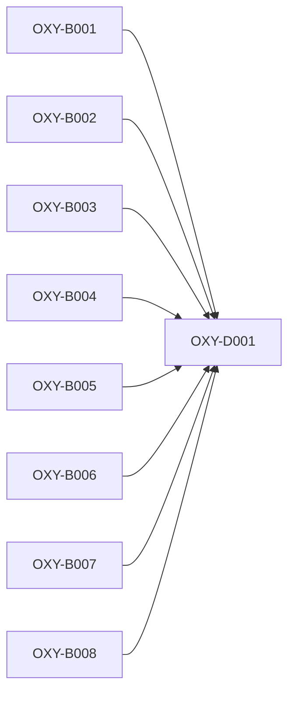

# Qualification planning critical path

- **Version:** v0.2.18
- **Active story points:** 22
- **Active phase:** Pre-implementation readiness research and Stage 3 reconciliation

## Critical path

The six co-critical paths are 5 story points each:

1. `OXY-B001` → `OXY-D001`
2. `OXY-B002` → `OXY-D001`
3. `OXY-B003` → `OXY-D001`
4. `OXY-B004` → `OXY-D001`
5. `OXY-B005` → `OXY-D001`
6. `OXY-B006` → `OXY-D001`

`OXY-B007` and `OXY-B008` also complete before `OXY-D001`, but their 3-story-point paths don't lengthen the critical path.

The critical path now runs from Epic B inputs to `OXY-D001`. The next critical epic is Epic B, Readiness research and coordination inputs.

## Build order

An arrow points from a prerequisite to a ticket that depends on it. Dependencies on completed tickets are satisfied and don't appear in the active graph.

## Phasing strategy

This active plan completes the remaining pre-implementation research and coordination inputs: Tier 1 platform-baseline recommendations, the common-case layout visit-cap recommendation, shared security-patch and fuzz-corpus policy, reference-hardware access, and assessor confirmations.

`OXY-D001` consolidates those inputs with the completed Epic C tooling, names every missing approved or captured lock input, and routes required Stage 3 revisions without claiming readiness. The work runs inside the reproducible devenv shell.

Candidate adapters, the integrated engine fork, shared product capabilities, scored probes, and measurements remain deferred. After Stage 3 reconciles the research results and approved pre-implementation inputs into a lock with `candidateImplementationReady: true`, Stage 4 can release another minor version to plan both candidates symmetrically. Measurement and scoring remain deferred until the later `measurementReady: true` gate. Production planning remains prohibited until mandatory Phase 3B.
